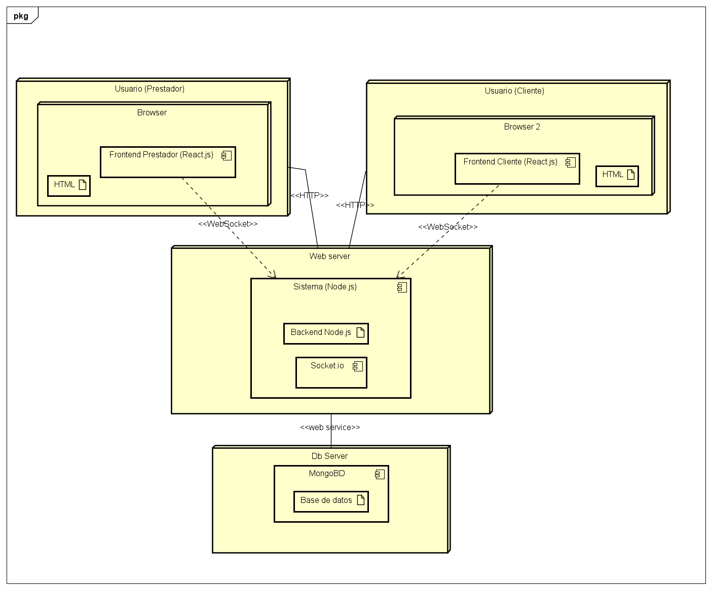
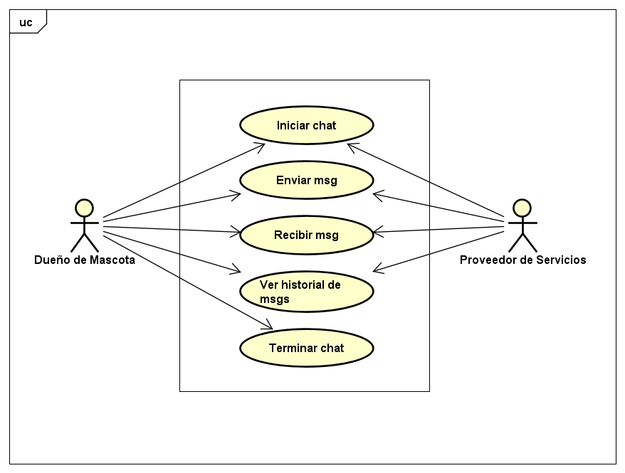
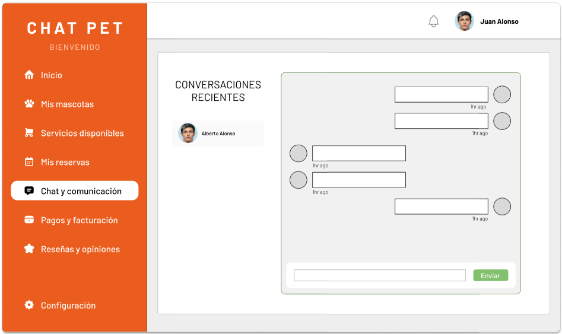
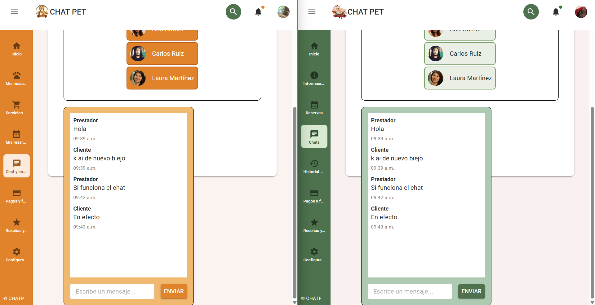

# CHAT PET
Este proyecto implementa un sistema distribuido para facilitar la comunicación entre clientes y proveedores de servicios dentro de la plataforma Pet's Ride. A través de este chat, los usuarios pueden interacturar en tiempo real con veterinarios, cuidadores, paseadores y otros profesionales del cuidado animal.


# 📌 Descripción
**Chat Pet** es un sistema de mensajería basado en una arquitectura **Cliente-Servidor** que emplea tecnologías modernas para garantizar una comunciación fluida, segura y escalable. Está diseñado para integrarse dentro del ecosistema más amplio de servicios de Pet's Ride, permitiendo conversaciones uno a uno mediante una API RESTful y una interfaz amigable.


## 🧩 ¿Por qué es un Sistema Distribuido?

El sistema está distribuido en varios componentes que interactúan entre sí a través de una red:
* **Clientes (FrontEnd)**: Aplicación ReactJS que se ejecuta en el navegador de usuario, conectándose al servidor para enviar y recibir mensajes.
* **Servidor (BackEnd)**: API REST desarrollada con Node.js y Express, responsable de gestionar la lógica de negocio, autenticación y almacenamiento de mensajes.
* **Base de Datos**: MongoDB como sistema de almacenamiento NoSQL distribuido, ideal para guardar conversaciones en tiempo real.
* **Comunicación**: Todo el intercambio de datos entre cliente y servidor se realiza mediante peticiones HTTP sobre una red, característica esencial de los sistemas distribuidos.

## ⚙️ Tecnologías utilizadas

| Componente       | Tecnología            |
|------------------|------------------------|
| Frontend         | ReactJS + Node.js      |
| Backend          | Node.js + Express.js   |
| Base de datos    | MongoDB                |
| Comunicación     | Servicios Web (REST)   |


# Arquitectura
El sistema **Chat Pet** está basado en una arquitectura de tipo Cliente-Servidor, donde los clientes (usuarios de la aplicación) se comunican con un servidor central a través de una interfaz RESTful. Esta arquitectura permite una separación clara entre la lógica de presentación (FrontEnd) y la lógica de negocio (BackEnd), lo que facilita el mantenimiento y la escalabilidad.
* **Cliente:** Aplicación que permite a los usuarios enviar y recibir mensajes. Se comunica con el servidor mediante solicitudes HTTP (GET, POST) para interactuar con los servicios disponibles, como autenticación, envío de mensajes y consulta de historial de conversación.
* **Servidor:** Encargado de procesar las solicitudes de los clientes, gestionar las sesiones, almacenar los mensajes en la base de datos y devolver respuestas estructuradas en formato JSON. Los endpoints REST permiten una comunicación estructurada y sencilla.
* **Base de datos:** Sistema de almacenamiento persistente que guarda la información de los usuarios, sus conversaciones y otros datos relevantes. El servidor actúa como intermediario entre la base de datos y los clientes.
  
**Flujo básico de funcionamiento:**
1. El cliente envía una solicitud HTTP al servidor (por ejemplo, para enviar mensaje).
2.	El servidor procesa la solicitud, interactúa con la base de datos si es necesario, y responde con una estructura JSON.
3.	El cliente interpreta la respuesta y actualiza la interfaz para el usuario.

Esta arquitectura permite una alta compatibilidad entre plataformas y dispositivos, ya que cualquier cliente que puede realizar peticiones HTTP puede integrarse con el sistema. Además, facilita la futura incorporación de nuevas funcionalidades como notificaciones push o integración con servicios externos.


# Diagramas del Sistema
1. Diagrama de Despligue
   <div align="center">
      
   </div>   
2. Diagrama de Casos de Uso
   <div align="center">
      
   </div>


# Interfaces de usuario
<div align="center">
   
</div>

🔗 [Ver diseño en Figma](https://www.figma.com/design/PELtlEl7AhFgfCv5fKukyD/Chat-Pet?node-id=0-1&t=XqNm3S2cBTtcCt1c-1)


# Ejemplo de funcionamiento
<div align="center">
   
</div>

 🔗 [Video de funcionamiento](https://youtu.be/ugWd8LkkoEU)


# 🚀 Cómo ejecutar el proyecto
1. Clonar el repositorio
   ```bash
      git clone https://github.com/LeticiaTejeroGamboa2401/ChatPet.git
      cd chat-pet
2. BackEnd
   ```bash
      cd backend
      npm install
      npm start
3. FrontEnd
   ```bash
      cd ../frontend
      npm install
      npm run dev

# 🤝 Colaboradores
<div>
<a href="https://github.com/ArmandoCanche"></a>
<a href="https://github.com/LeticiaTejeroGamboa2401"></a>
<a href="https://github.com/LuisLagunez"></a>
</div>
